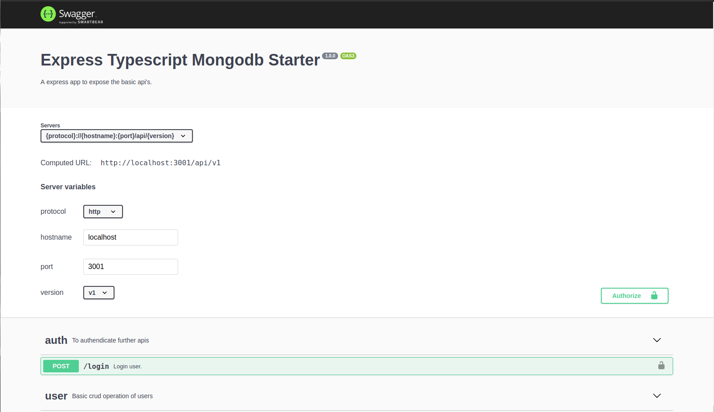
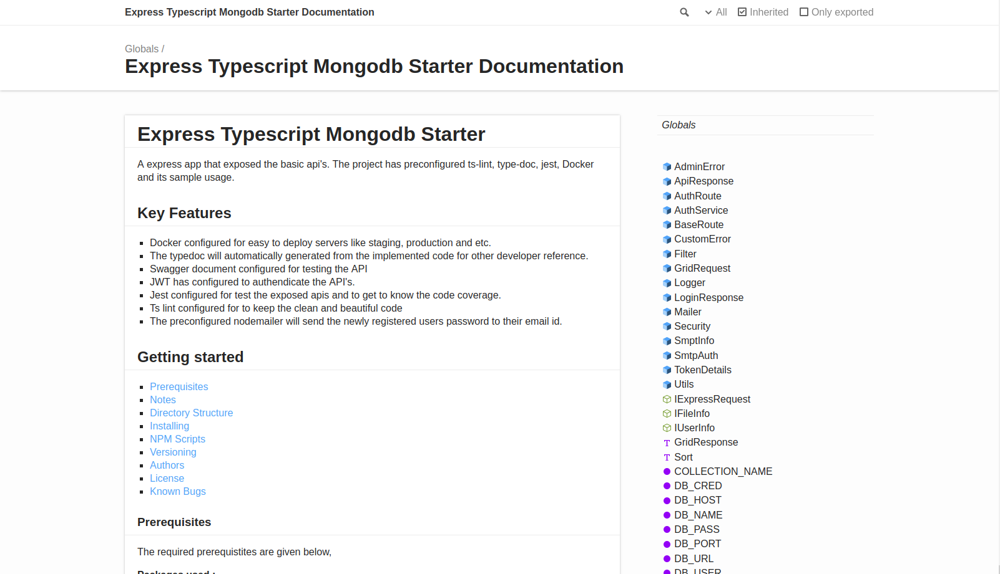
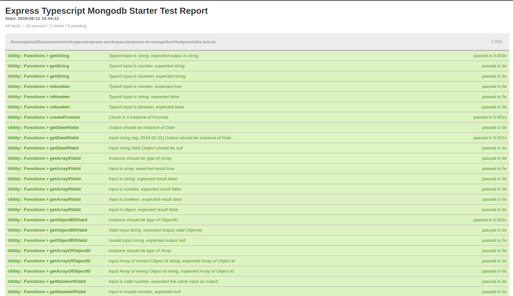

# How to deploy a Express Typescript Mongodb Starter on Ubuntu 16.04

* [Install Docker](#1-install-docker)
* [Pull Mongodb](#2-pull-mongodb)
* [Pull etms](#3-pull-etms)
* [Docker Compose](#4-docker-compose)
* [Run etms](#5-run-etms)
* [Preparing Database](#6-preparing-database)
* [Confirm server running status](#7-confirm-server-running-status)

## 1. Install Docker
[Docker guide.](https://docs.docker.com/install/linux/docker-ce/ubuntu/)

```shell
sudo apt-get update
```
```shell
sudo apt-get install \
    apt-transport-https \
    ca-certificates \
    curl \
    software-properties-common
```
```shell
curl -fsSL https://download.docker.com/linux/ubuntu/gpg | sudo apt-key add -
```
```shell
sudo add-apt-repository \
   "deb [arch=amd64] https://download.docker.com/linux/ubuntu \
   $(lsb_release -cs) \
   stable"
```
```shell
sudo apt-get update
```
```shell
sudo apt-get install docker-ce
```

## 2. Pull Mongodb
```shell
docker pull mongo:latest
```

## 3. Pull etms
```shell
docker pull gokulakannan/etms:latest
```

## 4. Docker Compose

Create `docker-compose.yml` by examples.

```yml
version: "3.7"
services:
  etms:
    image: gokulakannan/etms:latest
    deploy:
      replicas: 1
      restart_policy:
        condition: on-failure
        delay: 5s
        max_attempts: 3
        window: 120s
    logging:
      driver: "json-file"
      options:
        max-size: "10m"
        max-file: "10"
    configs:
      - source: env
        target: /usr/src/app/.env
    ports:
      - 3001:3001
    depends_on:
      - mongo
  mongo:
    image: mongo:latest
    ports:
      - 27017:27017
    volumes:
      - mongo:/data/db
volumes:
  mongo:
configs:
  env:
    file: .env
```

## 5. Run etms
```shell
docker stack deploy -c docker-compose.yml etms-stack-service
```
Check logs
```shell
docker container ls
docker logs <container id>
```

## 6. Preparing Database
Run `npm run setup` on etms container to add default data and create indexes.

```shell
docker container ls
docker exec <container id> bash -c "npm run setup && npm run test"
```

## 7. Confirm server running status

 - Swagger documentation (http://hostname:port/api-docs)


 - Technical documentation (http://hostname:port/technical-document/)


 - Test Report (http://hostname:port/test-report/)

